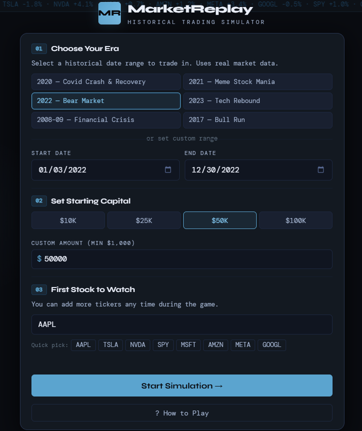
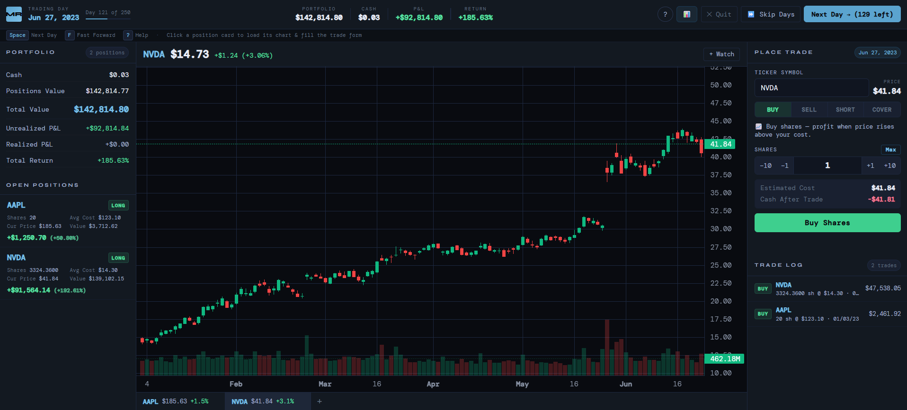
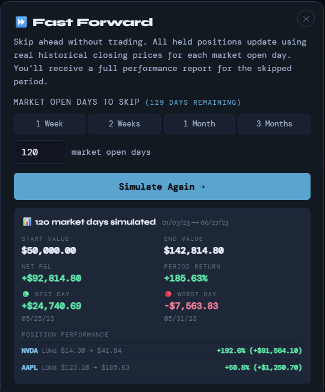
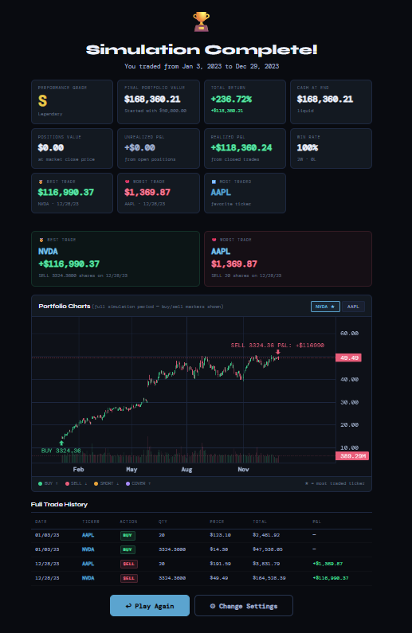

# MarketReplay — Historical Stock Trading Simulator

> Trade stocks using **real historical market data**. Pick any date range from 2000 to present, configure your starting capital, and navigate the market day by day — buying, selling, and shorting just like a real trader, with the benefit of hindsight only after you've made your moves.

MarketReplay is a full-stack web application built with a **Python FastAPI backend** and a **vanilla JavaScript single-page frontend**. It fetches real OHLCV (Open/High/Low/Close/Volume) data from Yahoo Finance, caches it in SQLite, and runs a financially accurate portfolio simulation complete with average cost basis tracking, short selling, fast-forward simulation, and a comprehensive end-of-game performance summary with annotated trade charts.

### Web Link: https://historical-stock-trading-simulator.onrender.com

---

## 📋 Table of Contents

- [Features](#features)
- [Tech Stack](#tech-stack)
- [Project Structure](#project-structure)
- [Getting Started](#getting-started)
  - [Prerequisites](#prerequisites)
  - [Installation](#installation)
  - [Running Locally](#running-locally)
- [How to Play](#how-to-play)
  - [Setup Screen](#setup-screen)
  - [Game Screen](#game-screen)
  - [Trading](#trading)
  - [Fast Forward](#fast-forward)
  - [End of Game](#end-of-game)
  - [Keyboard Shortcuts](#keyboard-shortcuts)
- [API Reference](#api-reference)
- [Architecture Overview](#architecture-overview)
  - [Backend Services](#backend-services)
  - [Frontend Components](#frontend-components)
  - [Data Flow](#data-flow)

---

## Features

**Core Simulation**
- Trade any publicly listed stock or ETF using real historical OHLCV data sourced from Yahoo Finance
- Navigate day by day through any historical date range (2000–present)
- Configurable starting capital (minimum $1,000)
- Only valid market open days are used — weekends and market holidays are automatically excluded

**Trading Mechanics**
- **BUY / SELL** long positions with average cost basis tracking across partial fills
- **SHORT / COVER** short selling with full cash collateral requirements
- **Fractional shares** supported to 2 decimal places
- **Max / All button** — auto-calculates maximum affordable quantity (BUY/SHORT) or full position size (SELL/COVER)
- Large-trade confirmation dialog (triggered at >$10,000 or >30% of available cash)

**Portfolio Dashboard**
- Real-time cash balance, positions value, total portfolio value
- Per-position unrealized P&L with percentage return
- Realized P&L tracking across all closed trades
- Clickable position cards — click any open position to instantly load its chart and pre-fill the trade form

**Charts**
- Interactive candlestick charts with volume histogram (TradingView Lightweight Charts)
- Multi-ticker watchlist bar
- Chart data hard-capped at the current in-game date — no look-ahead bias possible
- Click the ticker label to switch symbols; type to search from 46 popular tickers

**Fast Forward**
- Skip 1 to N market open days in one step (capped dynamically to days remaining)
- All positions updated with real historical closing prices for each skipped day
- Returns a detailed report: net P&L, period return, best day, worst day, per-position price change

**End-of-Game Summary**
- Performance grade (S / A / B / C / D / F) based on total return
- Full financial breakdown: cash balance, open positions value at final market close price, unrealized P&L, realized P&L, total return
- Open positions table — unsold holdings valued at final closing price, included in total portfolio value
- Best and worst closed trades highlighted
- Favorite ticker calculation (weighted by trade count and total volume)
- Full trade history log
- **Annotated charts for every traded ticker** — the full simulation period with colored arrow markers at each trade execution date (BUY ↑ green, SELL ↓ rose, SHORT ↓ amber, COVER ↑ lavender)

**UX**
- Quit early at any time — full summary is shown immediately
- Play Again with same settings (one click, no page reload)
- Change Settings — return to setup screen to adjust date range or capital
- Keyboard shortcuts: `Space` next day, `F` fast-forward, `?` help
- Mid-game performance summary modal (📊 button)
- How to Play walkthrough (6-slide modal)
- Toast notifications for day changes, trade confirmations, errors

---

## Tech Stack

| Layer | Technology | Version | Purpose |
|---|---|---|---|
| Backend Framework | FastAPI | 0.111.0 | REST API, static file serving |
| ASGI Server | Uvicorn | 0.29.0 | Production-grade async server |
| Market Data | yfinance | 0.2.37 | Historical OHLCV data from Yahoo Finance |
| Database ORM | SQLAlchemy | 2.0.30 | SQLite schema, queries, session management |
| Database | SQLite | (built-in) | Price cache, game sessions, trades, positions |
| Data Processing | pandas / numpy | 2.2.2 / 1.26.4 | DataFrame handling from yfinance |
| Frontend | Vanilla JavaScript | ES2020 | No build step, zero dependencies |
| Charts | Lightweight Charts | 4.1.3 | TradingView candlestick/histogram library |
| Fonts | Google Fonts | — | Syne (display), DM Mono (data) |

---

## Project Structure

```
stock-trader-sim/
├── render.yaml                  # Render deployment config
├── start.sh                     # One-command local launcher
├── README.md
│
├── backend/
│   ├── main.py                  # FastAPI app — entry point, routes, static serving
│   ├── requirements.txt
│   ├── game_data.db             # SQLite database (auto-created on first run)
│   │
│   ├── db/
│   │   ├── __init__.py
│   │   └── database.py          # SQLAlchemy models: GameSession, Position, Trade, PriceCache
│   │
│   ├── models/
│   │   └── __init__.py          # Pydantic request/response models
│   │
│   ├── routers/
│   │   ├── __init__.py
│   │   ├── game.py              # /api/game/* — create, advance, quit, summary
│   │   ├── market.py            # /api/market/* — chart data, price, search, summary-charts
│   │   ├── portfolio.py         # /api/portfolio/* — trade execution, snapshot, history
│   │   └── simulation.py        # /api/simulation/fastforward
│   │
│   └── services/
│       ├── __init__.py
│       ├── data_service.py      # yfinance fetch + SQLite cache + trading calendar
│       ├── game_engine.py       # Game session lifecycle, day advancement, completion detection
│       ├── portfolio_service.py # Trade execution, P&L calculation, end-game summary
│       └── ff_engine.py         # Fast-forward simulation engine
│
└── frontend/
    ├── index.html               # Single-page app shell — all screens defined here
    ├── style.css                # Complete stylesheet (~900 lines, CSS variables throughout)
    ├── app.js                   # Main controller: screen state machine, game loop, listener management
    │
    ├── components/
    │   ├── chart.js             # Candlestick chart, watchlist, ticker switching
    │   ├── portfolio.js         # Portfolio dashboard rendering, position cards
    │   ├── trading.js           # Trade form, qty stepper, confirm dialog
    │   ├── fastforward.js       # Fast-forward modal, dynamic max days, results report
    │   ├── howtoplay.js         # 6-slide help modal
    │   └── summarychart.js      # End-of-game annotated charts with trade markers
    │
    └── utils/
        ├── api.js               # All fetch() calls to backend — typed wrappers
        └── format.js            # Currency, percentage, date formatting helpers
```

### About `__init__.py`

Every Python subdirectory (`db/`, `models/`, `routers/`, `services/`) contains an empty `__init__.py` file. This marks each directory as a Python package, enabling cross-module imports like `from services.game_engine import create_game`. Without these files, Python raises `ModuleNotFoundError` at startup.

---

## Getting Started

### Prerequisites

- **Python 3.9+** — [python.org/downloads](https://python.org/downloads)
- **pip** — included with Python 3.9+
- A modern web browser (Chrome, Firefox, Safari, Edge)
- Internet connection (for initial data fetch from Yahoo Finance; subsequent runs use the local cache)

### Installation

```bash
# 1. Clone the repository
git clone https://github.com/YOUR_USERNAME/market-replay.git
cd market-replay

# 2. (Optional but recommended) Create a virtual environment
python3 -m venv venv
source venv/bin/activate        # macOS / Linux
venv\Scripts\activate           # Windows

# 3. Install backend dependencies
cd backend
pip install -r requirements.txt
```

### Running Locally

**Option A — One-command launcher (recommended)**
```bash
# From the project root:
bash start.sh
```

**Option B — Manual**
```bash
cd backend
uvicorn main:app --reload --port 8000
```

**Option C — Different port**
```bash
PORT=3000 bash start.sh
# or:
uvicorn main:app --reload --port 3000
```

Then open **http://localhost:8000** in your browser.

The first time you start a simulation, the backend fetches price data from Yahoo Finance and caches it in `backend/game_data.db`. Subsequent games using the same tickers and date range load from cache instantly.

> **Note:** The `--reload` flag watches for file changes and restarts automatically — useful during development. Remove it for stable local use.

---

## How to Play

### Setup Screen

> 

1. **Choose Your Era** — Pick a historical date range using a preset (e.g. "2020 — Covid Crash & Recovery") or set custom start/end dates. The minimum range is 1 week; end date must be in the past.
2. **Set Starting Capital** — Choose from $10K, $25K, $50K, $100K, or enter a custom amount (minimum $1,000).
3. **First Stock to Watch** — Type any ticker symbol (e.g. `AAPL`, `TSLA`, `SPY`) or pick a quick-select. More tickers can be added during the game.
4. Click **Start Simulation →**. The backend fetches the data (a few seconds on first run) and the game begins.

---

### Game Screen

> 

The game screen has three panels:

**Left Panel — Portfolio**
- Current cash balance, positions value, total portfolio value
- Unrealized and realized P&L
- Open positions list — click any position card to load its chart and pre-fill the trade form

**Centre Panel — Chart**
- Candlestick chart for the selected ticker, showing the full history up to today's in-game date
- Click the ticker symbol at the top left to switch to a different symbol
- The watchlist bar below the chart shows all tracked tickers with live prices and daily % change
- Click **+ Watch** to add more tickers to the watchlist

**Right Panel — Trade**
- Trade form with ticker input, BUY / SELL / SHORT / COVER action tabs, and quantity stepper
- **Max** button fills the maximum affordable quantity; **All** fills the full open position
- Cost preview updates in real time as you adjust quantity
- Trade log shows all executed trades in reverse chronological order

---

### Trading

**BUY**
Purchase shares of a stock. Your profit or loss is unrealized until you sell. Average cost basis is tracked correctly across multiple purchases of the same ticker.

**SELL**
Close all or part of a long position. Realized P&L is calculated as `(current_price − avg_cost) × quantity` and added to your cash balance.

**SHORT**
Borrow and sell shares, betting the price will fall. Requires cash collateral equal to the full position value (`quantity × price`). Profit if the price falls before you cover.

**COVER**
Close a short position. If the price fell since you shorted, you profit. If it rose, you lose. Cash collateral is returned plus/minus the P&L: `(avg_short_price − cover_price) × quantity`.

> ⚠️ If your total portfolio value reaches $0, the simulation ends immediately.

---

### Fast Forward

> 

Click **⏩ Skip Days** (or press `F`) to skip multiple market open days at once.

- Select a preset (1 Week, 2 Weeks, 1 Month, 3 Months) or enter a custom number of days
- The maximum is dynamically capped to the number of market days remaining in your simulation
- All open positions are updated with real historical closing prices for each skipped day, one by one
- After simulating, a report shows: net P&L, period return %, best day, worst day, and per-position price changes

---

### End of Game

> 

The simulation ends when you:
- Reach the final trading day of your chosen date range (via Next Day or Fast Forward)
- Your portfolio value hits $0 (game over)
- Click **✕ Quit** and confirm ending early

The summary screen shows:
- **Performance Grade** (S/A/B/C/D/F) based on total return vs starting capital
- **Full financial breakdown** — cash, open positions value at final market close, realized P&L, unrealized P&L, total return
- **Open Positions at End** — unsold holdings valued at the final closing price, included in the total portfolio calculation
- **Best and worst trades** — highlighted in dedicated cards
- **Annotated charts** for every ticker you traded — the full simulation period with colored arrow markers showing exactly where you bought, sold, shorted, and covered
- **Full trade history** table

From the summary screen:
- **↩ Play Again** — restart immediately with the same date range and capital (no page reload, all game sessions are independent)
- **⚙ Change Settings** — return to the setup screen to adjust the date range, capital, or starting ticker

---

### Keyboard Shortcuts

| Key | Action |
|-----|--------|
| `Space` | Advance one trading day |
| `F` | Open Fast Forward dialog |
| `?` | Open How to Play help |

---

## API Reference

The backend exposes a REST API served at `http://localhost:8000`. Interactive Swagger documentation is available at **http://localhost:8000/docs**.

### Game Endpoints

| Method | Path | Description |
|--------|------|-------------|
| `POST` | `/api/game/new` | Create a new game session. Body: `{start_date, end_date, initial_balance, starting_tickers}` |
| `GET` | `/api/game/{id}` | Get full game state including positions and progress |
| `POST` | `/api/game/{id}/advance` | Advance one trading day. Returns portfolio change and new status |
| `POST` | `/api/game/{id}/quit` | End game early. Returns full end-game summary |
| `GET` | `/api/game/{id}/summary` | Full end-of-game performance summary |

### Market Endpoints

| Method | Path | Description |
|--------|------|-------------|
| `GET` | `/api/market/chart` | OHLCV bars for `?game_id=&ticker=`, capped at current in-game date |
| `GET` | `/api/market/price` | Current-day closing price for a ticker |
| `GET` | `/api/market/search` | Search ticker symbols `?q=` — returns name + symbol matches |
| `POST` | `/api/market/prefetch` | Pre-cache ticker data for a game's full date range |
| `GET` | `/api/market/validate` | Check if a ticker symbol exists and has data |
| `GET` | `/api/market/summary-charts` | Full OHLCV + trade annotations for all tickers in a game |

### Portfolio Endpoints

| Method | Path | Description |
|--------|------|-------------|
| `POST` | `/api/portfolio/trade` | Execute BUY / SELL / SHORT / COVER. Body: `{game_id, ticker, action, quantity}` |
| `GET` | `/api/portfolio/{id}` | Full portfolio snapshot: positions, P&L, totals |
| `GET` | `/api/portfolio/{id}/history` | Complete trade history in reverse chronological order |

### Simulation Endpoints

| Method | Path | Description |
|--------|------|-------------|
| `POST` | `/api/simulation/fastforward` | Simulate N market days. Body: `{game_id, days}` |

---

## Architecture Overview

### Backend Services

**`data_service.py`**
Wraps `yfinance.download()` to fetch historical OHLCV data and stores it in the `price_cache` SQLite table. Exposes `get_trading_days()` which uses SPY as a reference ticker to derive the valid market calendar (automatically handles weekends and holidays for any date range). Includes a nearest-prior-date fallback so charts don't break on data gaps.

**`game_engine.py`**
Manages the `GameSession` lifecycle: creation, day advancement, and completion detection. On each `advance_day()` call, it moves `current_date` to the next valid trading day, recalculates total portfolio value, and checks for completion (reached final day) or game-over (portfolio ≤ $0). The response shape is consistent whether the game ends or continues.

**`portfolio_service.py`**
Executes trades against the `Position` and `Trade` tables with full financial accuracy:
- BUY: deducts cash, updates position with weighted average cost basis
- SELL: returns cash, computes realized P&L as `(price − avg_cost) × qty`
- SHORT: takes cash collateral, records short position
- COVER: returns collateral ± realized P&L
- `get_end_game_summary()` computes the full final breakdown including open positions valued at last closing price

**`ff_engine.py`**
Iterates each trading day in the requested range sequentially, applies mark-to-market pricing to all positions, and accumulates daily P&L. Returns a structured report with best/worst days and per-position changes. Sets `status = "completed"` if the last simulated day is the final trading day.

### Frontend Components

**`app.js`**
The application controller. Manages three screens (setup, game, gameover) as a state machine. Uses module-scoped boolean guards (`_setupInitOnce`, `_bound` in each component, `_handleGameEndCalled`) to prevent duplicate event listener registration across multiple game sessions on the same page load — a common SPA pitfall when DOM elements persist but game state resets.

**`chart.js`**
Initialises a TradingView Lightweight Charts instance with candlestick and volume series. Manages a watchlist of tickers, refreshes all of them on each day advance. The chart hard-caps displayed data at `game.current_date` by filtering bars at the API layer — the backend never returns future data.

**`trading.js`**
Handles the trade form. Uses a single `_bound` guard so all event listeners (qty stepper, action tabs, execute button, confirm dialog) are attached exactly once per page load, preventing the doubling-on-replay bug.

**`summarychart.js`**
Fetches `/api/market/summary-charts` after the game ends, builds a full-period chart for each traded ticker, and overlays colored arrow markers at each trade's exact date using Lightweight Charts' `setMarkers()` API. Same-day multiple trades are merged into single markers with aggregated quantity and P&L.

### Data Flow

```
Browser → apiFetch() → FastAPI Router → Service Layer → SQLAlchemy → SQLite
                                     ↕
                              yfinance (first fetch only)
                                     ↕
                              price_cache table (all subsequent reads)
```

The entire frontend is served as static files by FastAPI itself — no separate web server or CDN needed. The `/{full_path:path}` catch-all route returns `index.html` for any non-API, non-file path, enabling clean SPA navigation.

---
